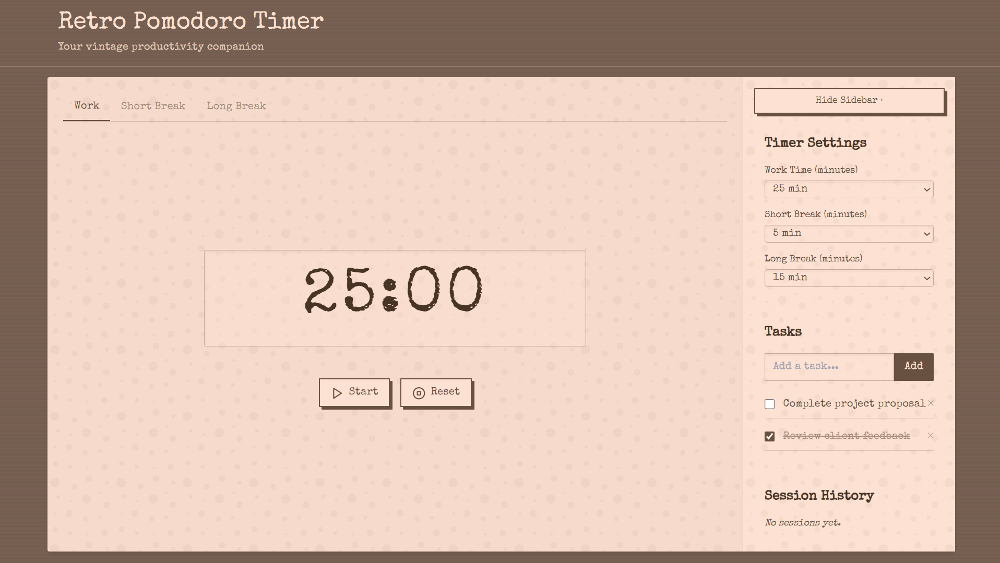
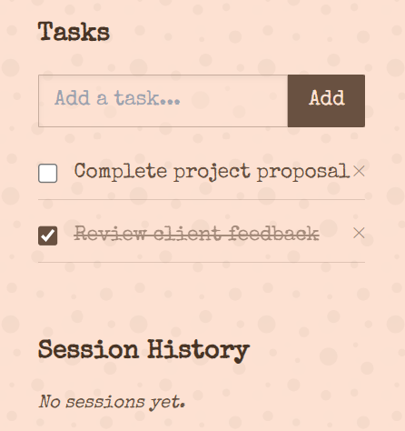

# 🕰️ Retro Pomodoro Timer

*A cozy, vintage-themed productivity companion for the browser.*



---

## 🎯 About

**Retro Pomodoro Timer** is a browser-based timer app that helps you stay productive using the Pomodoro Technique. Designed with a nostalgic 70s retro style, it offers a warm and focused workspace environment—perfect for deep work sessions, cozy coding, or creative writing.

---

## ✨ Features

* ⏱ Pomodoro timer with **Work**, **Short Break**, and **Long Break** modes
* 🎨 Retro aesthetic with brown as the primary color and vintage typewriter-style fonts
* 🧠 Task tracking to help you stay organized
* 🗂 Session history to reflect on your progress
* 🛠 Customizable session durations
* 💻 Fully responsive, works in modern browsers

---

## 🌐 Live Demo

👉 [Try the Retro Pomodoro Timer online](https://your-live-demo-link.com)
*(Replace this link with your actual deployment URL)*

---

## 📦 Installation

To run the project locally:

### 1. Clone the repository

```bash
git clone https://github.com/yourusername/retro-pomodoro-timer.git
cd retro-pomodoro-timer
```

### 2. Open in your browser

Just open `index.html` in your favorite browser.

Alternatively, if you're using VS Code:

```bash
npx live-server
```

---

## 🛠 Tech Stack

* **HTML** – Structure
* **CSS** – Styling (vintage-inspired using browns, creams, and soft shadows)
* **JavaScript** – Timer functionality and task management

---

## 📁 Folder Structure

```
retro-pomodoro-timer/
│
├── index.html       # Main UI
├── style.css        # Retro theme and layout
├── script.js        # Timer and interactivity logic
└── README.md
```

---

## 🖼 Screenshots

| Timer View                          | Task List & Settings                |
| ----------------------------------- | ----------------------------------- |
|  |  |

---

## 🧠 Motivation

This project was created to blend productivity with calmness—no dark dashboards or aggressive alarms, just a simple, soothing Pomodoro experience with vintage flair.
